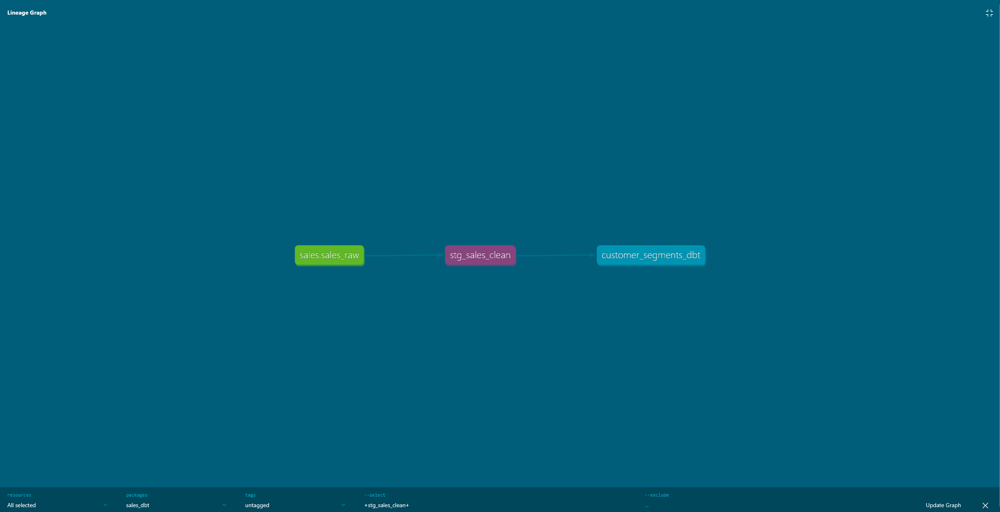

# dbt Sales Analytics

A dbt project transforming sales data using SQL-based models, tests, and auto-generated documentation — built as a companion to [`etl-sales-pipeline`](https://github.com/BartoszKalinowski1/etl-sales-pipeline), demonstrating a declarative (dbt) approach to the same transformation logic implemented imperatively in Python.

## What it does

Reads raw sales data already loaded into PostgreSQL by the `etl-sales-pipeline` project, and transforms it through two dbt models:

1. **`stg_sales_clean`** — filters out invalid records (zero/negative quantity or price, and corrupted `NaN` price values) and calculates `revenue`
2. **`customer_segments_dbt`** — aggregates cleaned data per customer (`total_orders`, `total_revenue`) and classifies each into a `High`/`Low` spending category

Both models are validated with automated tests (`not_null`, `unique`) and documented with an interactive lineage graph.

## Lineage
sales.sales_raw  →  stg_sales_clean  →  customer_segments_dbt



## Repository structure

```
dbt-sales-analytics/
├── .gitignore
├── README.md
├── docs/
│   └── lineage_graph.png
└── sales_dbt/
    ├── dbt_project.yml
    └── models/
        ├── marts/customer_segments_dbt.sql
        ├── schema.yml      # Column-level tests (not_null, unique)
        ├── sources.yml     # Declares sales_raw, sales_clean as external 
        └── staging/stg_sales_clean.sql
```
## Tech stack

| Tool | Purpose |
|---|---|
| dbt Core | SQL-based data transformation, testing, documentation |
| PostgreSQL 15 | Target database (shared with `etl-sales-pipeline`) |
| Docker | Database runs containerized (via `etl-sales-pipeline`'s `docker-compose.yml`) |

## How to run

**1. Start the shared PostgreSQL database** (from `etl-sales-pipeline`)
```bash
cd ../etl-sales-pipeline
docker-compose up -d
```

**2. Install dbt**
```bash
pip install dbt-postgres
```

**3. Configure your profile** (`~/.dbt/profiles.yml`)
```yaml
sales_dbt:
  target: dev
  outputs:
    dev:
      type: postgres
      host: localhost
      port: 5432
      user: admin
      password: admin
      dbname: sales_db
      schema: dbt_dev
      threads: 4
```

**4. Run the models**
```bash
cd sales_dbt
dbt run
```

**5. Run tests**
```bash
dbt test
```

**6. View documentation**
```bash
dbt docs generate
dbt docs serve
```

## A real bug, found and fixed

While building `stg_sales_clean`, one customer's `total_revenue` came back as `NaN` despite the model's `price > 0` filter. Root cause: a synthetic bad record in the source data had a literal `'NaN'` value stored in a `numeric` column — a value that passes numeric comparisons like `price > 0` unpredictably depending on type casting. Fixed by explicitly excluding it:

```sql
where quantity > 0 
  and price > 0 
  and price != 'NaN'::numeric
```

This is exactly the kind of edge case that a `not_null` test in `schema.yml` catches automatically on every run, rather than relying on someone noticing a bad row manually.

## Why this project exists

`etl-sales-pipeline` implements extract, transform, and load logic imperatively in Python. This project implements the *transform* step declaratively in SQL using dbt, against the same underlying dataset — a deliberate comparison of the two paradigms and the tooling (Airflow-orchestrated Python vs. dbt-managed SQL) most commonly used in modern data engineering.